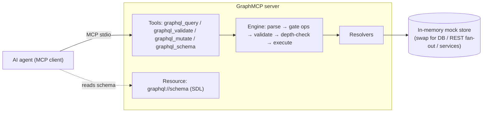

# GraphMCP

**An MCP server that speaks GraphQL.** Instead of exposing one tool per endpoint,
GraphMCP gives AI agents a single typed query surface: the agent reads the schema,
then composes exactly the query it needs — nested relations in one call, only the
fields it wants.

Ships with a mock blog dataset (users → posts → comments) so you can try it the
moment you clone it.

## Why

| Concern | Tool-per-endpoint MCP server | GraphMCP |
| --- | --- | --- |
| Tool count | Grows with the API (tool explosion) | 4 fixed tools |
| Over-fetching | Full payloads → wasted tokens | Agent selects only needed fields |
| Related data | One round trip per relation | Nested selections, single call |
| Discoverability | Prose tool descriptions | Typed schema (SDL) with doc strings |
| Self-correction | Errors only after execution | Pre-flight `graphql_validate` + structured GraphQL errors |

## Quickstart

Requires Python 3.10+.

```sh
git clone https://github.com/<you>/GraphMCP.git
cd GraphMCP
python -m venv .venv

# Windows
.venv\Scripts\python.exe -m pip install -e ".[dev]"
.venv\Scripts\python.exe -m pytest -q     # verify: 12 tests

# macOS / Linux
.venv/bin/python -m pip install -e ".[dev]"
.venv/bin/python -m pytest -q
```

## Interacting with it

### Option 1 — MCP Inspector (fastest way to poke at the mock data)

```sh
npx @modelcontextprotocol/inspector .venv/Scripts/python.exe -m graphmcp.server
```

Opens a browser UI where you can list the tools, read the `graphql://schema`
resource, and run queries by hand.

### Option 2 — VS Code agent mode

[.vscode/mcp.json](.vscode/mcp.json) is preconfigured. Open the repo in VS Code,
start the `graphmcp` server from the MCP view, then ask Copilot agent mode things
like *"Who commented on Grace Hopper's posts?"* and watch it discover the schema
and compose queries.

### Option 3 — Any MCP client (Claude Desktop, etc.)

```json
{
  "mcpServers": {
    "graphmcp": {
      "command": "/absolute/path/to/GraphMCP/.venv/bin/python",
      "args": ["-m", "graphmcp.server"],
      "env": { "GRAPHMCP_ALLOW_MUTATIONS": "1" }
    }
  }
}
```

(On Windows the command is `...\GraphMCP\.venv\Scripts\python.exe`.)

## What the server exposes

| Kind | Name | Purpose |
| --- | --- | --- |
| Resource | `graphql://schema` | The SDL, loadable as context up front |
| Tool | `graphql_schema()` | Same SDL for clients that prefer tools over resources |
| Tool | `graphql_validate(query)` | Parse + validate + measure depth **without executing** |
| Tool | `graphql_query(query, variables?)` | Read-only execution; mutations rejected |
| Tool | `graphql_mutate(mutation, variables?)` | Writes, only when `GRAPHMCP_ALLOW_MUTATIONS=1` |

### Example: query the mock data

```graphql
query($role: Role) {
  users(role: $role) {
    name
    posts(limit: 2) {
      title
      comments { author { name } text }
    }
  }
}
```

with variables `{"role": "ADMIN"}` returns, in one round trip:

```json
{"data": {"users": [{"name": "Ada Lovelace", "posts": [{"title": "...", "comments": [...]}]}]}}
```

### Example: write to the mock data

```graphql
mutation($input: CreatePostInput!) {
  createPost(input: $input) { id published }
}
```

with `{"input": {"authorId": "u3", "title": "Hello", "body": "..."}}`.
The store is in-memory — restart the server and you're back to the seed data.

## Configuration

| Env var | Default | Effect |
| --- | --- | --- |
| `GRAPHMCP_ALLOW_MUTATIONS` | off | Set to `1` to enable `graphql_mutate` |
| `GRAPHMCP_MAX_DEPTH` | `10` | Max query nesting depth (fragment-cycle safe) |

Other rails: `graphql_query` hard-rejects mutations, subscriptions are always
rejected, and all errors come back as standard GraphQL `{message, locations, path}`
shapes that models know how to read and repair.

## How it's built



Each layer is independently swappable:

- [src/graphmcp/data.py](src/graphmcp/data.py) — in-memory mock dataset. Replace with any real backend.
- [src/graphmcp/schema.py](src/graphmcp/schema.py) — SDL with doc strings (they travel to the model) + resolver wiring.
- [src/graphmcp/engine.py](src/graphmcp/engine.py) — execution pipeline with safety rails; no MCP dependency.
- [src/graphmcp/server.py](src/graphmcp/server.py) — thin MCP wiring: tools, resource, instructions.

## Roadmap ideas

- Swap `data.py` for a real datasource (SQL, REST fan-out, microservices) — the
  classic GraphQL gateway pattern, now agent-facing.
- Per-field auth, query cost analysis, timeouts, result-size caps.
- Persisted-query allowlists for high-trust deployments.
- GraphQL subscriptions mapped onto MCP notifications.

Contributions and issues welcome.
